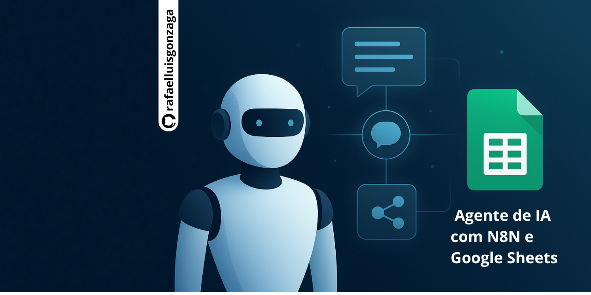

 
 # 🤖 Agente de IA com N8N e Google Sheets

Este projeto demonstra a criação de um **Agente de Inteligência Artificial (IA)** utilizando a ferramenta de automação **N8N**, integrada ao **Google Sheets** para registrar conversas e adicionar funcionalidades avançadas como **memória contextual** e **ferramentas externas (RAGs)**.

O agente pode ser acessado por meio de um **link público (chatbot online)**. (No repo há imagens desse acesso)

---

## 💡 O que você encontrará neste repositório

Uma imagem que mostra um **workflow de automação** no **N8N** que:

- Inicia com o recebimento de uma mensagem de chat.
- Filtra e mapeia os dados de entrada (`sessionId` e `chatInput`).
- Registra as conversas em uma planilha do Google Sheets.
- Processa a mensagem por meio de um Agente de IA.
- Utiliza memória para manter interações contextuais.
- Possui ferramentas (RAGs) como **Calculadora** e **Wikipedia** para enriquecer as respostas.

---

## ⚙️ Tecnologias Utilizadas

- **N8N** – Ferramenta de automação open source.  
  > O fluxo foi desenvolvido em uma instalação local do N8N utilizando **Docker**.
- **Google Sheets** – Utilizado para armazenar o histórico das conversas (`idConversa` e `Mensagem`).
- **Modelo de IA** – O modelo **Google Gemini Chat Model** foi escolhido como base para o agente.

---

## 🧠 Arquitetura do Agente de IA (visão geral)

- **Modelo:** Google Gemini  
- **Prompt Base:** Contém as instruções gerais do comportamento do agente.  
- **Memória:** Armazena contexto de curto e longo prazo.  
- **RAG (Base de Conhecimento):** Utilizado para “treinar” o agente com dados personalizados (PDF, textos, URLs, etc).  
- **Tools (Funções):** Executam ações externas, como consultar o Google, enviar mensagens (WhatsApp/Email), verificar o clima ou interagir com bancos de dados.

---

## 📝 Configuração do Workflow

### 1. Gatilho Inicial

- O fluxo é iniciado pelo nó **“When chat message received”**.  
- Para acesso público, a **URL do webhook** é obtida nesse nó.

---

### 2. Node “Edit Fields”

Este nó é usado para **filtrar e renomear** os dados de entrada.  
- Modo: **Manual Mapping**.  
- Campos mapeados:  
  - `idConversa (String)` ← `$json.sessionId`  
  - `Mensagem (String)` ← `$json.chatInput`

---

### 3. Integração com Google Sheets

O nó **“Append row in sheet”** realiza a integração.

- **Conexão:** Utiliza a credencial `Google Sheets account`, configurada com `Client ID` e `Client Secret` obtidos no **Google Cloud Console**.  
  > É necessário habilitar as APIs do **Google Sheets** e **Google Drive**.  
- **Operação:** `Append Row`.  
- **Documento/Aba:** `Curso N8N Gratuito - Tutorial #1` → aba `Case1`.

Valores enviados:  
- `IdConversa` → `{{ $json.idConversa }}` (do nó *Edit Fields*)  
- `Mensagem` → `{{ $json.Mensagem }}` (do nó *Edit Fields*)

---

### 4. Agente de IA (AI Agent)

- **Modelo:** Google Gemini Chat Model  
- **Prompt (User Message):** `{{ $('Edit Fields').item.json.Mensagem }}`  
- **System Message (Instrução):** Define a personalidade e o tom de resposta do agente.  
  > Exemplo: “Você é um super agente de suporte. Seja educado, engraçado e utilize emojis para tornar a conversa mais humana.”  
- **Memória:**  
  - Implementada com o nó **“Simple Memory”**.  
  - Utiliza o **Session ID** (ID da conversa) → `{{ $('Edit Fields').item.json.idConversa }}`  
  - Permite que o agente reconheça o contexto e mantenha a continuidade das conversas.  
- **Ferramentas (RAGs):**  
  - **Calculator** e **Wikipedia** foram adicionadas para ampliar as capacidades do agente.

---

## 🚀 Como Executar

1. Instale o **Docker** e o **N8N** localmente.  
2. Configure suas credenciais do Google Cloud (Client ID e Secret).  
3. Importe o workflow do repositório para o N8N.  
4. Configure a planilha no Google Sheets conforme as variáveis indicadas.  
5. Inicie o fluxo e interaja com o agente via webhook.

---

Feito com 💙 usando **N8N**, **Google Sheets** e **Gemini AI**.

## 📄 Curso N8N Gratuito Para Iniciantes 2025 | Crie Automações com IA 

